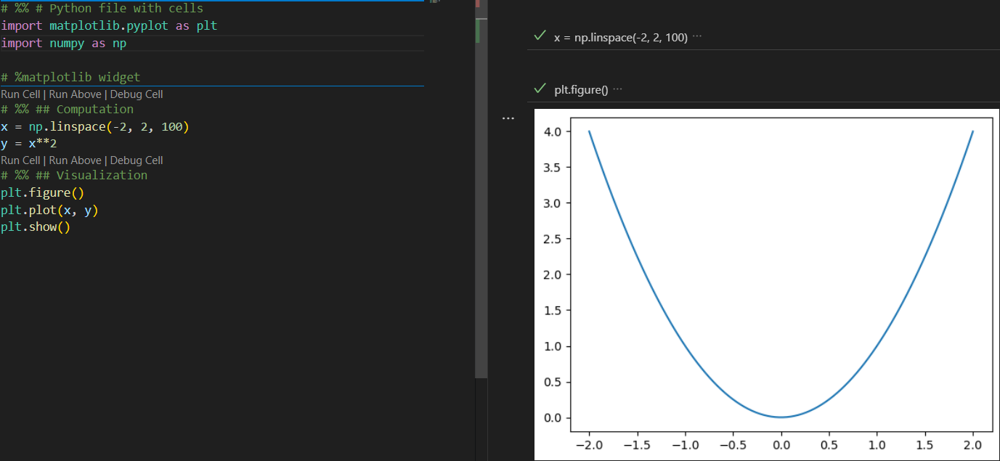
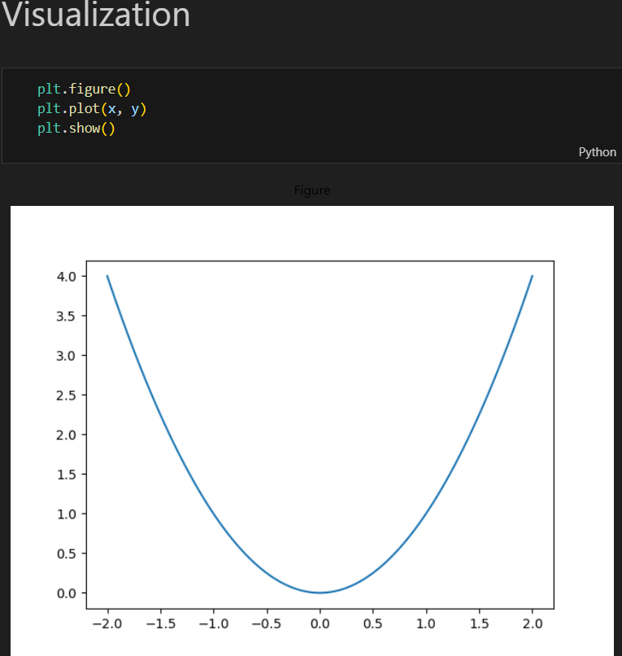

# Introduction
Python is as a multi-purpose programming language heavily used in various branches of science. Apart from software development in science, prominent is scripting based approach for computation, scientific visualization, data analysis, model development etc. Python being inherently programming free language emulates in some degree other tools like MATLAB, Wolfram Mathematica, R among many.

Scripting based approach is often related with pile of scripts without clear structure and library incompatibilities. Python offers from software development point of view some tools and way of working to mitigate such problems:

- project based scripting
- version control (git)
- virtual environment (.venv)
- code formatters
- type hints

Techniques like Unit testing or CI/CD pipelines are usually omitted and are devoted to software development itself.

All presented tools are intended to work locally without cloud services or subscription; eventually at institution´s intranet. The presented text is opinionated and not encompass all Python-world options.

# Integrated Development Environment (IDE)
There are plenty of IDE. Spyder focuses directly on science/data science and has MATLAB alike appearance (Editor window, Variable Explorer/Plots and IPython Console for interactive work). However, working with virtual environment is partially tedious (restart Spyder). PyCharm is "all-in-one" partially paid product (pro) with installation about 1 Gb. Visual Studio Code is a lightweight customizable IDE with easy git integration and "real-time" virtual environment switching capability. Hence, VS Code will be used further. Presented methods will occasionally rely on CLI (command line interface) and generally, IDE can be used according to reader´s preferences. JupyterLab is out scope of this text because .ipynb can be run from Visual Studio Code (with ipykernel library)

# Project Based Scripting
Science is generally connected with the idea-testing with lot of iterations. Hence, there are often scripts like 'model_temp.py; model_temp_v2.py' etc. The good project structure and version control allows to keep code cleaner, maintain basic documentation for further usage. There is often enough to follow shallow structure:
```
hertz_pressure
- src
    - core
        contact.py
    compute.py
```
```hertz_pressure``` contains only one script file  ```compute.py``` where will be import ```from core import contact as contact``` and code. Assuming, the project cannot be rigorously structured (Hertz pressure calculation are well established), or the input data are constantly changing is often be advantageous naming with date e.g.
```
hertz_pressure
- src
    - core
        contact.py
    20250827_compute.py
    20250829_add_new_geom_par.py
    ...
```
and short information into the file header.

It is strongly recommended to think project/task oriented and focus on specific scientific task. It is additionally recommended use project oriented .venv (pip alike) instead of global (conda alike). Using project based scripting and .venv help immensely initiate new fork from current project.

# Virtual Environment (.venv)
Virtual environments are closely related with package managers and it is the most crucial part. Scientists need to install libraries to create "scientific calculator" from Python programming language. Basic solution is often all-in-all Anaconda distribution and working in base environment - it is generally not recommended practice but allows uncomplicated scripting at the beginning. The big issue starts after necessity to install additional libraries. Working on multiple projects, it usually ends with conflicting library version and not functioned old scripts. Create a separate "global conda" environment like "data_science" mitigates such situations but at the end, the situation will be repeated later (regardless lightweight conda distributions like Miniconda or Miniforge). Additionally (despite progress in recent years), conda can be concluded as a slow packed manager.

Project related libraries can be installed locally to created .venv by default pip manager or python native library venv. Library management is left to user. Newer managers like poetry or uv extended and modernize dependency management (from requirements.txt to pyproject.toml) and other features. uv integrates venv, is fast and automatically update all installed dependencies. User has to pay no attention to the library management and pyproject.toml can be easily transformed to new project, if necessary. After installation, new project will be started by:
```
uv init
```
and new project structure will be created:
```
hertz_pressure
- .gitignore
- .python-version
- README.md
- main.py
- pyproject.toml
```
Virtual environment will created by:
```
uv run 
```
and new environment will be created.

Created pyproject.toml contains
```
[project]
name = "hertz_pressure"
version = "0.1.0"
description = "Add your description here"
readme = "README.md"
dependencies = []

```
and library can be added
```
uv add numpy pandas matplotlib
```
or removed
```
uv remove numpy matplotlib
``` 
pyproject.toml will be automatically updated. Read uv documentation for further information.

Additional scientific package WinPython is one all-in-one portable solution out of focus of this text.

# Version Control
Version control with code repository help to archive legacy code, share scripts with colleagues and keep workspace clean (actually not used code can be deleted from local workspace and downloaded if necessary or code can be reviewed in Web Browser). Self-hosted solution should be run on back-up hard-disk or ideally at institution´s fileserver (contact your IT-administrator).

Gogs offers simple self-hosted git service; Gitea offers broader functionality with appearance much alike popular software development cloud services GitHub or GitLab. While software is usually not developed in science, simple solution will be recommended.

# .py or .ipynb?
Pure python files (.py) are preferred for developed functions stored in ```\src\core``` directories and batch processing. Python files can be run in interactive mode in Visual Studio Code with installed ipykernel. Jupyter Notebook (.ipynb) can be executed in Visual Studio Code with Jupyter Extensions (downloaded automatically at first .ipynb execution). In figures below are interactive .py with cells ([Figure \ref{fig:interactive-python}
](#fig:interactive-python)) and ipynb script ([Figure \ref{fig:jupyter-notebook}
](#fig:jupyter-notebook)):

{#fig:interactive-python width=100%}

{#fig:jupyter-notebook width=50%}

Python file tends to be shorter with figure placed into the separated right interactive window (install ipympl and uncomment %matplotlib widget to work interactively with figures). Jupyter Notebook places cells output top-bottom and markdown cells are visually more appealing but script is far less concise. Nevertheless, use only .ipynb for interactive work with graph (see next chapter).

# Code Formatter

Code formatter is an extremely useful tool to maintain readability of code. However, autopep8 extension doesn´t work within .ipynb (use %matplotlib widget  # noqa to allow code formation in interactive .py) and tends to be slow. Another official extension Black Formatter or Ruff from same company like uv package manager don´t work with %matplotlib widget in .py. Therefore, use only .ipynb when working with graphs in interactive manner.

Setup chosen code formatter on "editor.formatOnSave": true ("notebook.formatOnSave.enabled": true) in Visual Studio Code for automatic code formatting.

# Type Hints
Use type hints within your functions - it is a minimal effort to write a code like this:
```
from typing import List


def ext_list(inp: List, a: int | float, b: int | float) -> List:
    """Return input list extended about added a + b"""
    c = a + b
    inp.append(c)

    return inp
```
instead of (NumPy docstring format):
```
def ext_list(inp, a, b):
    """ Re-writed by copilot.microsoft.com
    Extend a list by appending the sum of two numbers.

    Parameters
    ----------
    inp : list
        The list to be extended.
    a : int or float
        The first number to add.
    b : int or float
        The second number to add.

    Returns
    -------
    list
        The input list with an additional element equal to ``a + b``.

    Examples
    --------
    >>> ext_list([1, 2], 3, 4)
    [1, 2, 7]
    >>> ext_list([], 1.5, 2.5)
    [4.0]
    """
    c = a + b
    inp.append(c)

    return inp
```
Function annotated by hints is much more readable and concise (even without example) as using NumPy docstring format.

Rule of thumb: if some developed procedure has to be used at least twice, create a function; AI excels in such situations (check your institution´s IT-policy). There is often necessity to change procedures in science but calling variety of functions e.g. from ```\src\core\core_funcs.py```:
```
from core import core_funcs as cf

inp_l = [1, 2, 3]
cf.ext_list(inp_l, 10, 20)
```

and keeping clean main code enhance readability.

# Conclusions
Some software development techniques were introduced to enhance reusability and readability of Python codes within scripting usual in scientific environment. Project based scripting was introduced as a main way organizing code. Additionally, package managers were introduced that support project based scripting and separated virtual environment. Starting from Version Control, interactive scripting and readability was discussed. Employing Code formatters and Type hints was shown how code readability can be enhanced and maintained with minimum additional scripting effort.